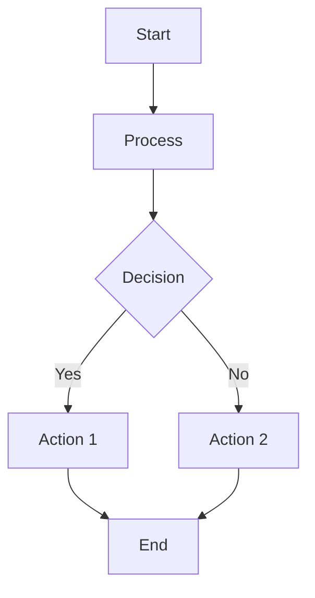

# Voile SOP Manager Plugin

A comprehensive Standard Operating Procedures (SOP) management plugin for Voile GLAM Management System. This plugin provides full lifecycle management for SOPs with Markdown authoring, review workflows, staff acknowledgements, and revision history.

## Features

- **Markdown Authoring**: Write SOPs using Markdown with the EasyMDE editor
- **Mermaid Diagrams**: Render flowcharts, sequence diagrams, and more using Mermaid.js
- **Workflow Management**: Complete status lifecycle (Draft → Under Review → Pending Approval → Active → Retired → Archived)
- **Staff Acknowledgements**: Track which staff members have read and acknowledged each SOP
- **Revision History**: Automatic versioning with full content snapshots
- **Dashboard Widget**: Quick overview of SOP statistics
- **Review Queue**: Dedicated view for SOPs requiring attention

## Installation

### 1. Add to Voile's `mix.exs`

```elixir
defp deps do
  [
    # ... other deps
    {:voile_sop_manager, path: "plugins/voile_sop_manager"}
  ]
end
```

### 2. Add CDN Links for EasyMDE and Mermaid

In `lib/voile_web/components/layouts/root.html.heex`, add:

```html
<!-- In <head> -->
<link rel="stylesheet" href="https://cdn.jsdelivr.net/npm/easymde/dist/easymde.min.css" />

<!-- Before </body>, after your app.js -->
<script src="https://cdn.jsdelivr.net/npm/easymde/dist/easymde.min.js"></script>
<script src="https://cdn.jsdelivr.net/npm/mermaid/dist/mermaid.min.js"></script>
```

### 3. Register the JS Hooks

In `assets/js/app.js`:

```javascript
import MarkdownEditor from "../../plugins/voile_sop_manager/assets/js/hooks/markdown_editor";
import MermaidRenderer from "../../plugins/voile_sop_manager/assets/js/hooks/mermaid_renderer";

let Hooks = {
  // ... existing hooks
  MarkdownEditor,
  MermaidRenderer,
};

let liveSocket = new LiveSocket("/live", Socket, {
  hooks: Hooks,
  // ... rest of config
});
```

### 4. Install and Activate

1. Run `mix deps.get`
2. Build and deploy your Voile application
3. Navigate to Admin → Settings → Plugins
4. Find "SOP Manager" and click Install
5. Activate the plugin

## Usage

### Creating an SOP

1. Navigate to the SOP Manager from the main menu
2. Click "+ New SOP"
3. Fill in the required fields:
   - **SOP Code**: Unique identifier (e.g., NAT-COL-HAND-001)
   - **Title**: Descriptive title
   - **Department**: Select from available departments
   - **Category**: Optional categorization
   - **Risk Level**: Low, Medium, or High
   - **Purpose & Scope**: Markdown section describing the SOP's purpose
   - **Content**: Main SOP content in Markdown
4. Click "Save Draft"

### Using Mermaid Diagrams

You can embed Mermaid diagrams in your SOP content using fenced code blocks:

````markdown

````

Supported diagram types:
- **Flowcharts**: `flowchart` or `graph`
- **Sequence diagrams**: `sequenceDiagram`
- **Class diagrams**: `classDiagram`
- **State diagrams**: `stateDiagram`
- **Entity Relationship**: `erDiagram`
- **Gantt charts**: `gantt`
- **Pie charts**: `pie`
- **Mindmaps**: `mindmap`

### SOP Lifecycle

```
Draft → Under Review → Pending Approval → Active → Retired → Archived
         ↑______________|                    ↓
                                    Superseded → Archived
```

| Status | Description |
|--------|-------------|
| Draft | Initial creation, can be edited |
| Under Review | Submitted for technical review |
| Pending Approval | Review passed, awaiting final approval |
| Active | Published and in effect |
| Superseded | Replaced by a newer version |
| Retired | No longer in effect |
| Archived | Historical record only |

### Staff Acknowledgement

When an SOP is active, staff members can acknowledge that they have read and understood it. This creates an audit trail showing who has reviewed each SOP version.

## Configuration

The plugin provides the following settings (accessible via Admin → Settings → Plugins → SOP Manager):

| Setting | Description | Default |
|---------|-------------|---------|
| `default_review_cycle_days` | Days between required reviews | 730 (2 years) |
| `require_acknowledgement` | Require staff to acknowledge active SOPs | true |
| `institution_code` | Code for SOP numbering (e.g., NAT) | ORG |
| `notify_on_status_change` | Send notifications on status changes | false |

## File Structure

```
plugins/voile_sop_manager/
├── mix.exs
├── README.md
├── lib/
│   ├── voile_sop_manager.ex              # Main plugin module
│   └── voile_sop_manager/
│       ├── application.ex
│       ├── migrator.ex
│       ├── sop.ex                        # Ecto schema
│       ├── sop_revision.ex               # Ecto schema
│       ├── sop_review.ex                 # Ecto schema
│       ├── sop_acknowledgement.ex        # Ecto schema
│       ├── sops.ex                       # Context module
│       ├── reviews.ex                    # Context module
│       ├── acknowledgements.ex           # Context module
│       ├── settings.ex
│       └── web/
│           ├── live/
│           │   ├── index_live.ex         # SOP list
│           │   ├── show_live.ex          # SOP detail
│           │   ├── editor_live.ex        # Create/Edit
│           │   └── review_live.ex        # Review queue
│           └── components/
│               └── widget.ex             # Dashboard widget
├── assets/
│   └── js/
│       └── hooks/
│           └── markdown_editor.js        # EasyMDE hook
└── priv/
    └── migrations/
        ├── 20250601000001_create_plugin_sop_manager_sops.exs
        ├── 20250601000002_create_plugin_sop_manager_revisions.exs
        ├── 20250601000003_create_plugin_sop_manager_reviews.exs
        └── 20250601000004_create_plugin_sop_manager_acknowledgements.exs
```

## Database Schema

### SOPs Table (`plugin_sop_manager_sops`)

| Column | Type | Description |
|--------|------|-------------|
| id | binary_id | Primary key |
| code | string | Unique SOP identifier |
| title | string | SOP title |
| department | string | Department code |
| category | string | Optional category |
| status | string | Current status |
| version_major | integer | Major version number |
| version_minor | integer | Minor version number |
| content | text | Markdown content |
| purpose | text | Purpose & scope section |
| owner_id | integer | User ID (soft reference) |
| effective_date | date | When SOP becomes effective |
| review_due_date | date | Next scheduled review |
| retired_at | naive_datetime | When retired |
| superseded_by_id | binary_id | ID of replacement SOP |
| risk_level | string | low/medium/high |
| tags | array of strings | Tags for categorization |

## API Reference

### Context Modules

#### `VoileSopManager.Sops`

- `list_sops(filters)` - List all SOPs with optional filtering
- `get_sop!(id)` - Get a single SOP by ID
- `get_sop_by_code!(code)` - Get a single SOP by code
- `create_sop(attrs, user_id)` - Create a new SOP
- `update_sop(sop, attrs, user_id, change_summary)` - Update an SOP
- `transition(sop, new_status)` - Transition SOP to new status
- `submit_for_review/1`, `request_revisions/1`, `pass_review/1`, `reject/1`, `approve/1`, `retire/1`, `archive/1` - Status transitions
- `count_by_status()` - Count SOPs grouped by status
- `list_overdue_reviews()` - List SOPs overdue for review

#### `VoileSopManager.Acknowledgements`

- `acknowledge(sop_id, user_id, version_major, version_minor)` - Record acknowledgement
- `acknowledged?(sop, user_id)` - Check if user acknowledged
- `count_acknowledged(sop_id)` - Count acknowledgements for an SOP

#### `VoileSopManager.Reviews`

- `create_review(attrs)` - Create a review record
- `list_reviews(sop_id)` - List reviews for an SOP
- `submit_review(review, attrs)` - Submit a review decision

## License

This plugin is provided as free software under the same license as Voile.

## Contributing

Contributions are welcome! Please submit pull requests to the Voile repository.
