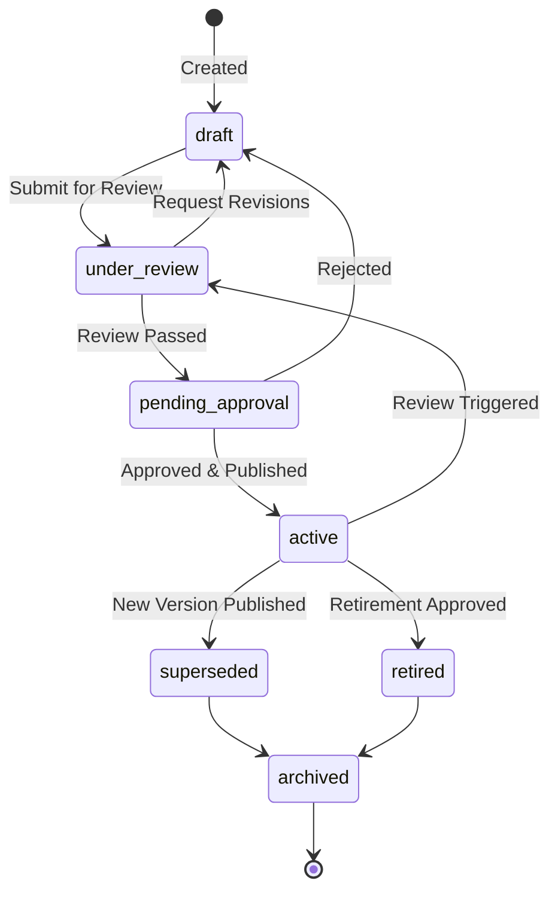
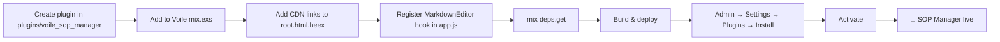
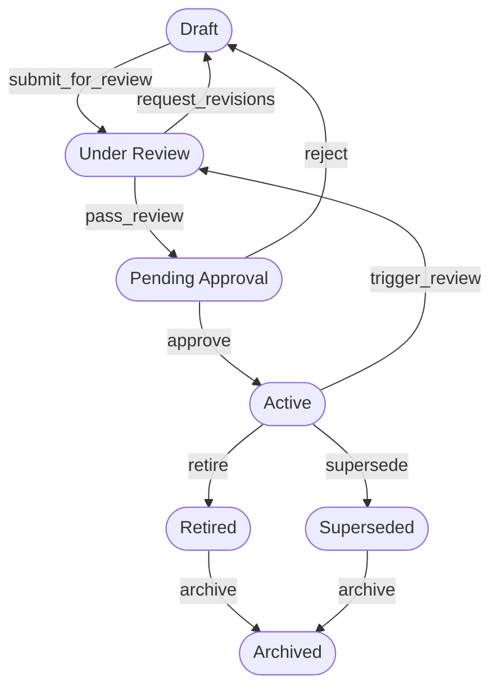

# SOP Plugin — Developer Implementation Guide
### `voile_sop_manager` · Voile Plugin

> **Purpose of this document**: A complete implementation spec for a coding agent to build the SOP Manager plugin for Voile (Phoenix/LiveView). All code, migrations, and wiring patterns are provided. Follow top-to-bottom.

---

## Table of Contents

1. [Plugin Overview](#1-plugin-overview)
2. [Markdown Editor Choice](#2-markdown-editor-choice)
3. [File Structure](#3-file-structure)
4. [Database Schema & Migrations](#4-database-schema--migrations)
5. [Ecto Schemas](#5-ecto-schemas)
6. [Context Modules](#6-context-modules)
7. [Plugin Main Module](#7-plugin-main-module)
8. [Migrator](#8-migrator)
9. [LiveView Pages](#9-liveview-pages)
10. [JS Hook (EasyMDE Integration)](#10-js-hook-easymde-integration)
11. [Dashboard Widget](#11-dashboard-widget)
12. [Settings Schema](#12-settings-schema)
13. [mix.exs](#13-mixexs)
14. [Wiring into Voile](#14-wiring-into-voile)
15. [SOP Lifecycle & Status Rules](#15-sop-lifecycle--status-rules)

---

## 1. Plugin Overview

**Plugin ID**: `sop_manager`  
**OTP App**: `:voile_sop_manager`  
**Module prefix**: `VoileSopManager`  
**Table prefix**: `plugin_sop_manager_`

### What It Does

Manages the full lifecycle of Standard Operating Procedures (SOPs) inside a GLAM institution. SOPs are authored in **Markdown** and pass through a defined status workflow (Draft → Under Review → Pending Approval → Active → Retired → Archived).

### Status State Machine



**Valid transitions table** (enforce in context module):

| From | To | Trigger |
|---|---|---|
| `draft` | `under_review` | `submit_for_review/1` |
| `under_review` | `draft` | `request_revisions/1` |
| `under_review` | `pending_approval` | `pass_review/1` |
| `pending_approval` | `draft` | `reject/1` |
| `pending_approval` | `active` | `approve/1` |
| `active` | `under_review` | `trigger_review/1` |
| `active` | `retired` | `retire/1` |
| `active` | `superseded` | `supersede/2` (when new version published) |
| `superseded` | `archived` | `archive/1` |
| `retired` | `archived` | `archive/1` |

---

## 2. Markdown Editor Choice

**Use [EasyMDE](https://github.com/Ionaru/easy-markdown-editor)** — loaded via CDN, no npm/bundler needed.

| Library | CDN | Phoenix Hook | Notes |
|---|---|---|---|
| **EasyMDE** ✅ | ✅ Simple | ✅ Easy | Best fit — attaches to `<textarea>`, minimal config |
| Toast UI Editor | ✅ Heavy | ⚠️ Complex | Requires ESM wiring, large bundle |
| CodeMirror 6 | ⚠️ ESM only | ⚠️ Requires shim | Powerful but needs build step |
| SimpleMDE | ✅ | ✅ | Abandoned, use EasyMDE instead |

### CDN URLs to Add to `root.html.heex`

```html
<!-- In <head> -->
<link rel="stylesheet" href="https://cdn.jsdelivr.net/npm/easymde/dist/easymde.min.css" />

<!-- Before </body> -->
<script src="https://cdn.jsdelivr.net/npm/easymde/dist/easymde.min.js"></script>
```

---

## 3. File Structure

```
plugins/voile_sop_manager/
├── mix.exs
├── README.md
├── lib/
│   ├── voile_sop_manager.ex                        # Plugin main module
│   └── voile_sop_manager/
│       ├── migrator.ex
│       ├── sop.ex                                  # Ecto schema: SOPs
│       ├── sop_revision.ex                         # Ecto schema: revision history
│       ├── sop_review.ex                           # Ecto schema: review records
│       ├── sop_acknowledgement.ex                  # Ecto schema: staff read receipts
│       ├── sops.ex                                 # Context: main CRUD + transitions
│       ├── reviews.ex                              # Context: review workflow
│       ├── acknowledgements.ex                     # Context: acknowledgements
│       ├── settings.ex
│       └── web/
│           └── live/
│               ├── index_live.ex                   # SOP list
│               ├── show_live.ex                    # SOP detail + reader view
│               ├── editor_live.ex                  # Create / Edit with markdown editor
│               ├── review_live.ex                  # Review queue
│               └── components/
│                   └── widget.ex                   # Dashboard widget
└── priv/
    └── migrations/
        ├── 20250601000001_create_plugin_sop_manager_sops.exs
        ├── 20250601000002_create_plugin_sop_manager_revisions.exs
        ├── 20250601000003_create_plugin_sop_manager_reviews.exs
        └── 20250601000004_create_plugin_sop_manager_acknowledgements.exs
```

---

## 4. Database Schema & Migrations

### Migration 1 — SOPs table

```elixir
# priv/migrations/20250601000001_create_plugin_sop_manager_sops.exs
defmodule VoileSopManager.Migrations.CreateSops do
  use Ecto.Migration

  def change do
    create table(:plugin_sop_manager_sops, primary_key: false) do
      add :id,              :binary_id, primary_key: true
      add :code,            :string, null: false       # e.g. "NAT-COL-HAND-001"
      add :title,           :string, null: false
      add :department,      :string, null: false       # "collections", "conservation", etc.
      add :category,        :string                    # "handling", "digitization", etc.
      add :status,          :string, null: false, default: "draft"
      add :version_major,   :integer, null: false, default: 1
      add :version_minor,   :integer, null: false, default: 0
      add :content,         :text                      # Markdown body
      add :purpose,         :text                      # Markdown: purpose & scope section
      add :owner_id,        :integer                   # Soft ref to Voile user
      add :effective_date,  :date
      add :review_due_date, :date
      add :retired_at,      :naive_datetime
      add :superseded_by_id, :binary_id               # Points to replacement SOP id
      add :risk_level,      :string, default: "low"   # "low" | "medium" | "high"
      add :tags,            {:array, :string}, default: []

      timestamps()
    end

    create unique_index(:plugin_sop_manager_sops, [:code])
    create index(:plugin_sop_manager_sops, [:status])
    create index(:plugin_sop_manager_sops, [:department])
    create index(:plugin_sop_manager_sops, [:review_due_date])
    create index(:plugin_sop_manager_sops, [:owner_id])
  end
end
```

### Migration 2 — Revisions table

```elixir
# priv/migrations/20250601000002_create_plugin_sop_manager_revisions.exs
defmodule VoileSopManager.Migrations.CreateRevisions do
  use Ecto.Migration

  def change do
    create table(:plugin_sop_manager_revisions, primary_key: false) do
      add :id,              :binary_id, primary_key: true
      add :sop_id,          :binary_id, null: false   # Soft ref to SOP
      add :version_major,   :integer, null: false
      add :version_minor,   :integer, null: false
      add :content,         :text                      # Snapshot of markdown at this version
      add :change_summary,  :string
      add :changed_by_id,   :integer                   # Soft ref to user
      add :status_at_save,  :string

      timestamps(updated_at: false)
    end

    create index(:plugin_sop_manager_revisions, [:sop_id])
  end
end
```

### Migration 3 — Reviews table

```elixir
# priv/migrations/20250601000003_create_plugin_sop_manager_reviews.exs
defmodule VoileSopManager.Migrations.CreateReviews do
  use Ecto.Migration

  def change do
    create table(:plugin_sop_manager_reviews, primary_key: false) do
      add :id,              :binary_id, primary_key: true
      add :sop_id,          :binary_id, null: false
      add :reviewer_id,     :integer, null: false      # Soft ref to user
      add :reviewer_role,   :string                    # "technical", "legal", "safety"
      add :decision,        :string                    # "approved" | "request_changes" | "rejected"
      add :comments,        :text
      add :reviewed_at,     :naive_datetime

      timestamps(updated_at: false)
    end

    create index(:plugin_sop_manager_reviews, [:sop_id])
    create index(:plugin_sop_manager_reviews, [:reviewer_id])
  end
end
```

### Migration 4 — Acknowledgements table

```elixir
# priv/migrations/20250601000004_create_plugin_sop_manager_acknowledgements.exs
defmodule VoileSopManager.Migrations.CreateAcknowledgements do
  use Ecto.Migration

  def change do
    create table(:plugin_sop_manager_acknowledgements, primary_key: false) do
      add :id,              :binary_id, primary_key: true
      add :sop_id,          :binary_id, null: false
      add :user_id,         :integer, null: false
      add :acknowledged_at, :naive_datetime, null: false
      add :version_major,   :integer                   # Which version they acknowledged
      add :version_minor,   :integer

      timestamps(updated_at: false)
    end

    create unique_index(:plugin_sop_manager_acknowledgements, [:sop_id, :user_id])
    create index(:plugin_sop_manager_acknowledgements, [:sop_id])
    create index(:plugin_sop_manager_acknowledgements, [:user_id])
  end
end
```

---

## 5. Ecto Schemas

### `sop.ex`

```elixir
defmodule VoileSopManager.Sop do
  use Ecto.Schema
  import Ecto.Changeset

  @primary_key {:id, :binary_id, autogenerate: true}

  @statuses ~w(draft under_review pending_approval active superseded retired archived)
  @risk_levels ~w(low medium high)
  @departments ~w(collections conservation archives library digital public_programs facilities administration)

  schema "plugin_sop_manager_sops" do
    field :code,            :string
    field :title,           :string
    field :department,      :string
    field :category,        :string
    field :status,          :string, default: "draft"
    field :version_major,   :integer, default: 1
    field :version_minor,   :integer, default: 0
    field :content,         :string
    field :purpose,         :string
    field :owner_id,        :integer
    field :effective_date,  :date
    field :review_due_date, :date
    field :retired_at,      :naive_datetime
    field :superseded_by_id, :binary_id
    field :risk_level,      :string, default: "low"
    field :tags,            {:array, :string}, default: []

    timestamps()
  end

  def changeset(sop, attrs) do
    sop
    |> cast(attrs, [:code, :title, :department, :category, :content, :purpose,
                    :owner_id, :effective_date, :review_due_date, :risk_level, :tags])
    |> validate_required([:code, :title, :department])
    |> validate_inclusion(:risk_level, @risk_levels)
    |> validate_inclusion(:department, @departments)
    |> unique_constraint(:code)
  end

  def status_changeset(sop, new_status) do
    sop
    |> change(status: new_status)
    |> validate_inclusion(:status, @statuses)
  end

  def version_string(%__MODULE__{version_major: maj, version_minor: min}),
    do: "v#{maj}.#{min}"

  def statuses, do: @statuses
  def risk_levels, do: @risk_levels
  def departments, do: @departments
end
```

### `sop_revision.ex`

```elixir
defmodule VoileSopManager.SopRevision do
  use Ecto.Schema
  import Ecto.Changeset

  @primary_key {:id, :binary_id, autogenerate: true}

  schema "plugin_sop_manager_revisions" do
    field :sop_id,         :binary_id
    field :version_major,  :integer
    field :version_minor,  :integer
    field :content,        :string
    field :change_summary, :string
    field :changed_by_id,  :integer
    field :status_at_save, :string

    timestamps(updated_at: false)
  end

  def changeset(revision, attrs) do
    revision
    |> cast(attrs, [:sop_id, :version_major, :version_minor, :content,
                    :change_summary, :changed_by_id, :status_at_save])
    |> validate_required([:sop_id, :version_major, :version_minor])
  end
end
```

### `sop_review.ex`

```elixir
defmodule VoileSopManager.SopReview do
  use Ecto.Schema
  import Ecto.Changeset

  @primary_key {:id, :binary_id, autogenerate: true}

  @decisions ~w(approved request_changes rejected)
  @reviewer_roles ~w(technical legal safety hr cross_department)

  schema "plugin_sop_manager_reviews" do
    field :sop_id,       :binary_id
    field :reviewer_id,  :integer
    field :reviewer_role, :string
    field :decision,     :string
    field :comments,     :string
    field :reviewed_at,  :naive_datetime

    timestamps(updated_at: false)
  end

  def changeset(review, attrs) do
    review
    |> cast(attrs, [:sop_id, :reviewer_id, :reviewer_role, :decision, :comments, :reviewed_at])
    |> validate_required([:sop_id, :reviewer_id, :decision])
    |> validate_inclusion(:decision, @decisions)
  end
end
```

### `sop_acknowledgement.ex`

```elixir
defmodule VoileSopManager.SopAcknowledgement do
  use Ecto.Schema
  import Ecto.Changeset

  @primary_key {:id, :binary_id, autogenerate: true}

  schema "plugin_sop_manager_acknowledgements" do
    field :sop_id,          :binary_id
    field :user_id,         :integer
    field :acknowledged_at, :naive_datetime
    field :version_major,   :integer
    field :version_minor,   :integer

    timestamps(updated_at: false)
  end

  def changeset(ack, attrs) do
    ack
    |> cast(attrs, [:sop_id, :user_id, :acknowledged_at, :version_major, :version_minor])
    |> validate_required([:sop_id, :user_id, :acknowledged_at])
    |> unique_constraint([:sop_id, :user_id])
  end
end
```

---

## 6. Context Modules

### `sops.ex` — Main Context

```elixir
defmodule VoileSopManager.Sops do
  import Ecto.Query
  alias Voile.Repo
  alias VoileSopManager.{Sop, SopRevision}

  # ── Queries ──────────────────────────────────────────────────────────────────

  def list_sops(filters \\ []) do
    query = from s in Sop, order_by: [desc: s.inserted_at]

    query
    |> maybe_filter_status(filters[:status])
    |> maybe_filter_department(filters[:department])
    |> maybe_filter_overdue_review()
    |> Repo.all()
  end

  def get_sop!(id), do: Repo.get!(Sop, id)

  def get_sop_by_code!(code), do: Repo.get_by!(Sop, code: code)

  def count_by_status do
    from(s in Sop, group_by: s.status, select: {s.status, count(s.id)})
    |> Repo.all()
    |> Map.new()
  end

  def list_overdue_reviews do
    from(s in Sop,
      where: s.status == "active" and s.review_due_date <= ^Date.utc_today(),
      order_by: [asc: s.review_due_date]
    )
    |> Repo.all()
  end

  # ── CRUD ─────────────────────────────────────────────────────────────────────

  def create_sop(attrs, user_id) do
    Repo.transaction(fn ->
      case %Sop{} |> Sop.changeset(attrs) |> Repo.insert() do
        {:ok, sop} ->
          snapshot_revision(sop, user_id, "Initial draft")
          sop
        {:error, changeset} ->
          Repo.rollback(changeset)
      end
    end)
  end

  def update_sop(%Sop{} = sop, attrs, user_id, change_summary \\ nil) do
    Repo.transaction(fn ->
      case sop |> Sop.changeset(attrs) |> Repo.update() do
        {:ok, updated_sop} ->
          # Bump minor version on content changes
          bumped = bump_minor_version(updated_sop)
          snapshot_revision(bumped, user_id, change_summary || "Content updated")
          bumped
        {:error, changeset} ->
          Repo.rollback(changeset)
      end
    end)
  end

  # ── Status Transitions ───────────────────────────────────────────────────────

  @valid_transitions %{
    "draft"             => ["under_review"],
    "under_review"      => ["draft", "pending_approval"],
    "pending_approval"  => ["draft", "active"],
    "active"            => ["under_review", "retired", "superseded"],
    "superseded"        => ["archived"],
    "retired"           => ["archived"],
    "archived"          => []
  }

  def transition(%Sop{} = sop, new_status) do
    allowed = Map.get(@valid_transitions, sop.status, [])

    if new_status in allowed do
      sop
      |> Sop.status_changeset(new_status)
      |> maybe_set_retired_at(new_status)
      |> Repo.update()
    else
      {:error, "Transition from '#{sop.status}' to '#{new_status}' is not allowed"}
    end
  end

  def submit_for_review(%Sop{} = sop), do: transition(sop, "under_review")
  def request_revisions(%Sop{} = sop), do: transition(sop, "draft")
  def pass_review(%Sop{} = sop),       do: transition(sop, "pending_approval")
  def reject(%Sop{} = sop),            do: transition(sop, "draft")
  def approve(%Sop{} = sop) do
    Repo.transaction(fn ->
      {:ok, approved_sop} = transition(sop, "active")
      # Bump major version on approval
      bump_major_version(approved_sop) |> Repo.update!()
    end)
  end
  def trigger_review(%Sop{} = sop),    do: transition(sop, "under_review")
  def retire(%Sop{} = sop),            do: transition(sop, "retired")
  def archive(%Sop{} = sop),           do: transition(sop, "archived")

  def supersede(%Sop{} = old_sop, %Sop{} = new_sop) do
    Repo.transaction(fn ->
      {:ok, _} = transition(old_sop, "superseded")
      Repo.update!(Ecto.Changeset.change(old_sop, superseded_by_id: new_sop.id))
      {:ok, approved} = approve(new_sop)
      approved
    end)
  end

  # ── Revision History ─────────────────────────────────────────────────────────

  def list_revisions(sop_id) do
    from(r in SopRevision,
      where: r.sop_id == ^sop_id,
      order_by: [desc: r.inserted_at]
    )
    |> Repo.all()
  end

  # ── Private Helpers ──────────────────────────────────────────────────────────

  defp snapshot_revision(sop, user_id, summary) do
    %SopRevision{}
    |> SopRevision.changeset(%{
      sop_id: sop.id,
      version_major: sop.version_major,
      version_minor: sop.version_minor,
      content: sop.content,
      change_summary: summary,
      changed_by_id: user_id,
      status_at_save: sop.status
    })
    |> Repo.insert!()
  end

  defp bump_minor_version(sop) do
    Ecto.Changeset.change(sop, version_minor: sop.version_minor + 1)
    |> Repo.update!()
  end

  defp bump_major_version(sop) do
    Ecto.Changeset.change(sop, version_major: sop.version_major + 1, version_minor: 0)
  end

  defp maybe_set_retired_at(changeset, "retired") do
    Ecto.Changeset.put_change(changeset, :retired_at, NaiveDateTime.utc_now())
  end
  defp maybe_set_retired_at(changeset, _), do: changeset

  defp maybe_filter_status(query, nil), do: query
  defp maybe_filter_status(query, status), do: where(query, [s], s.status == ^status)

  defp maybe_filter_department(query, nil), do: query
  defp maybe_filter_department(query, dept), do: where(query, [s], s.department == ^dept)

  defp maybe_filter_overdue_review(query), do: query  # Opt-in via caller
end
```

### `acknowledgements.ex`

```elixir
defmodule VoileSopManager.Acknowledgements do
  import Ecto.Query
  alias Voile.Repo
  alias VoileSopManager.SopAcknowledgement

  def acknowledge(sop_id, user_id, version_major, version_minor) do
    %SopAcknowledgement{}
    |> SopAcknowledgement.changeset(%{
      sop_id: sop_id,
      user_id: user_id,
      acknowledged_at: NaiveDateTime.utc_now(),
      version_major: version_major,
      version_minor: version_minor
    })
    |> Repo.insert(on_conflict: :replace_all, conflict_target: [:sop_id, :user_id])
  end

  def acknowledged?(%{id: sop_id}, user_id) do
    Repo.exists?(
      from a in SopAcknowledgement,
        where: a.sop_id == ^sop_id and a.user_id == ^user_id
    )
  end

  def count_acknowledged(sop_id) do
    Repo.aggregate(
      from(a in SopAcknowledgement, where: a.sop_id == ^sop_id),
      :count
    )
  end
end
```

---

## 7. Plugin Main Module

```elixir
# lib/voile_sop_manager.ex
defmodule VoileSopManager do
  @behaviour Voile.Plugin

  @impl true
  def metadata do
    %{
      id: "sop_manager",
      name: "SOP Manager",
      version: "1.0.0",
      author: "Your Institution",
      description: "Full lifecycle management for Standard Operating Procedures. " <>
                   "Author SOPs in Markdown, route through review and approval workflows, " <>
                   "track staff acknowledgements, and maintain revision history.",
      license_type: :free,
      icon: "📋",
      tags: ["sop", "compliance", "workflow", "glam", "documentation"]
    }
  end

  @impl true
  def on_install do
    VoileSopManager.Migrator.run()
  end

  @impl true
  def on_activate, do: :ok

  @impl true
  def on_deactivate, do: :ok

  @impl true
  def on_uninstall do
    VoileSopManager.Migrator.rollback()
  end

  @impl true
  def on_update(_old, _new) do
    VoileSopManager.Migrator.run()
  end

  @impl true
  def hooks do
    [
      {:dashboard_widgets, &__MODULE__.add_widget/1}
    ]
  end

  @impl true
  def routes do
    [
      {"/",           VoileSopManager.Web.Live.IndexLive,  :index},
      {"/new",        VoileSopManager.Web.Live.EditorLive, :new},
      {"/:id",        VoileSopManager.Web.Live.ShowLive,   :show},
      {"/:id/edit",   VoileSopManager.Web.Live.EditorLive, :edit},
      {"/review",     VoileSopManager.Web.Live.ReviewLive, :review}
    ]
  end

  @impl true
  def settings_schema do
    [
      %{
        key: :default_review_cycle_days,
        type: :integer,
        label: "Default Review Cycle (days)",
        default: 730,
        required: false
      },
      %{
        key: :require_acknowledgement,
        type: :boolean,
        label: "Require staff to acknowledge active SOPs",
        default: true
      },
      %{
        key: :institution_code,
        type: :string,
        label: "Institution Code (for SOP numbering, e.g. NAT)",
        default: "ORG",
        required: true
      },
      %{
        key: :notify_on_status_change,
        type: :boolean,
        label: "Send notifications on status changes",
        default: false
      }
    ]
  end

  def add_widget(widgets) do
    widget = %{
      key: :sop_manager_stats,
      title: "SOP Manager",
      component: VoileSopManager.Web.Components.Widget,
      priority: 40
    }
    widgets ++ [widget]
  end
end
```

---

## 8. Migrator

```elixir
# lib/voile_sop_manager/migrator.ex
defmodule VoileSopManager.Migrator do
  use Voile.Plugin.Migrator, otp_app: :voile_sop_manager
end
```

---

## 9. LiveView Pages

### `index_live.ex` — SOP List

```elixir
defmodule VoileSopManager.Web.Live.IndexLive do
  use Phoenix.LiveView

  alias VoileSopManager.{Sops, Settings}

  @impl true
  def mount(_params, _session, socket) do
    {:ok,
     socket
     |> assign(:page_title, "SOP Manager")
     |> assign(:filter_status, nil)
     |> assign(:filter_department, nil)
     |> load_sops()
     |> assign(:status_counts, Sops.count_by_status())
     |> assign(:overdue, Sops.list_overdue_reviews())}
  end

  @impl true
  def handle_params(params, _uri, socket) do
    {:noreply,
     socket
     |> assign(:filter_status, params["status"])
     |> assign(:filter_department, params["department"])
     |> load_sops()}
  end

  @impl true
  def handle_event("filter", %{"status" => status, "department" => dept}, socket) do
    params = %{status: status, department: dept}
    {:noreply, push_patch(socket, to: ~p"/manage/plugins/sop_manager/?#{params}")}
  end

  @impl true
  def render(assigns) do
    ~H"""
    <div class="space-y-6">
      <!-- Header -->
      <div class="flex items-center justify-between">
        <h2 class="text-2xl font-bold text-gray-900 dark:text-white">📋 SOP Manager</h2>
        <.link navigate={~p"/manage/plugins/sop_manager/new"}
               class="btn btn-primary">
          + New SOP
        </.link>
      </div>

      <!-- Status summary pills -->
      <div class="flex gap-2 flex-wrap">
        <span :for={{status, count} <- @status_counts}
              phx-click="filter" phx-value-status={status} phx-value-department=""
              class={"cursor-pointer px-3 py-1 rounded-full text-sm font-medium #{status_pill_class(status)}"}>
          <%= status_label(status) %> (<%= count %>)
        </span>
      </div>

      <!-- Overdue review alert -->
      <div :if={@overdue != []}
           class="bg-amber-50 border border-amber-200 rounded-lg p-4 text-amber-800">
        ⚠️ <strong><%= length(@overdue) %> SOP(s)</strong> are overdue for review.
      </div>

      <!-- SOP Table -->
      <div class="bg-white dark:bg-gray-800 rounded-lg shadow overflow-hidden">
        <table class="min-w-full divide-y divide-gray-200 dark:divide-gray-700">
          <thead class="bg-gray-50 dark:bg-gray-700">
            <tr>
              <th class="px-6 py-3 text-left text-xs font-medium text-gray-500 uppercase">Code</th>
              <th class="px-6 py-3 text-left text-xs font-medium text-gray-500 uppercase">Title</th>
              <th class="px-6 py-3 text-left text-xs font-medium text-gray-500 uppercase">Dept.</th>
              <th class="px-6 py-3 text-left text-xs font-medium text-gray-500 uppercase">Status</th>
              <th class="px-6 py-3 text-left text-xs font-medium text-gray-500 uppercase">Version</th>
              <th class="px-6 py-3 text-left text-xs font-medium text-gray-500 uppercase">Review Due</th>
              <th class="px-6 py-3"></th>
            </tr>
          </thead>
          <tbody class="divide-y divide-gray-200 dark:divide-gray-700">
            <tr :for={sop <- @sops} class="hover:bg-gray-50 dark:hover:bg-gray-700">
              <td class="px-6 py-4 text-sm font-mono text-gray-600"><%= sop.code %></td>
              <td class="px-6 py-4 text-sm font-medium text-gray-900 dark:text-white">
                <.link navigate={~p"/manage/plugins/sop_manager/#{sop.id}"}>
                  <%= sop.title %>
                </.link>
              </td>
              <td class="px-6 py-4 text-sm text-gray-500"><%= sop.department %></td>
              <td class="px-6 py-4">
                <span class={"px-2 py-1 text-xs rounded-full #{status_pill_class(sop.status)}"}>
                  <%= status_label(sop.status) %>
                </span>
              </td>
              <td class="px-6 py-4 text-sm text-gray-500"><%= Sop.version_string(sop) %></td>
              <td class="px-6 py-4 text-sm text-gray-500">
                <span class={if overdue?(sop), do: "text-red-600 font-semibold"}>
                  <%= format_date(sop.review_due_date) %>
                </span>
              </td>
              <td class="px-6 py-4 text-right">
                <.link navigate={~p"/manage/plugins/sop_manager/#{sop.id}/edit"}
                       class="text-sm text-blue-600 hover:underline">
                  Edit
                </.link>
              </td>
            </tr>
          </tbody>
        </table>

        <div :if={@sops == []} class="text-center py-12 text-gray-500">
          No SOPs found. <.link navigate={~p"/manage/plugins/sop_manager/new"} class="text-blue-600">Create the first one.</.link>
        </div>
      </div>
    </div>
    """
  end

  # ── Private helpers ──
  defp load_sops(socket) do
    sops = Sops.list_sops(
      status: socket.assigns[:filter_status],
      department: socket.assigns[:filter_department]
    )
    assign(socket, :sops, sops)
  end

  defp status_label("draft"),            do: "Draft"
  defp status_label("under_review"),     do: "Under Review"
  defp status_label("pending_approval"), do: "Pending Approval"
  defp status_label("active"),           do: "Active"
  defp status_label("superseded"),       do: "Superseded"
  defp status_label("retired"),          do: "Retired"
  defp status_label("archived"),         do: "Archived"
  defp status_label(s),                  do: s

  defp status_pill_class("draft"),            do: "bg-gray-100 text-gray-700"
  defp status_pill_class("under_review"),     do: "bg-yellow-100 text-yellow-800"
  defp status_pill_class("pending_approval"), do: "bg-purple-100 text-purple-800"
  defp status_pill_class("active"),           do: "bg-green-100 text-green-700"
  defp status_pill_class("superseded"),       do: "bg-orange-100 text-orange-700"
  defp status_pill_class("retired"),          do: "bg-gray-200 text-gray-500"
  defp status_pill_class("archived"),         do: "bg-gray-300 text-gray-600"
  defp status_pill_class(_),                  do: "bg-gray-100 text-gray-500"

  defp format_date(nil), do: "—"
  defp format_date(date), do: Date.to_string(date)

  defp overdue?(%{review_due_date: nil}), do: false
  defp overdue?(%{review_due_date: d, status: "active"}), do: Date.compare(d, Date.utc_today()) == :lt
  defp overdue?(_), do: false
end
```

---

### `editor_live.ex` — Create / Edit with EasyMDE

This is the most important LiveView — it mounts the EasyMDE editor via a JS hook.

```elixir
defmodule VoileSopManager.Web.Live.EditorLive do
  use Phoenix.LiveView

  alias VoileSopManager.{Sop, Sops}

  @impl true
  def mount(params, session, socket) do
    user_id = get_in(session, ["user_id"]) || 1

    {sop, action} =
      case params do
        %{"id" => id} -> {Sops.get_sop!(id), :edit}
        _             -> {%Sop{}, :new}
      end

    changeset = Sop.changeset(sop, %{})

    {:ok,
     socket
     |> assign(:sop, sop)
     |> assign(:action, action)
     |> assign(:user_id, user_id)
     |> assign(:changeset, changeset)
     |> assign(:page_title, if(action == :new, do: "New SOP", else: "Edit SOP"))}
  end

  @impl true
  def handle_event("save", %{"sop" => sop_params}, socket) do
    %{sop: sop, action: action, user_id: user_id} = socket.assigns

    result =
      if action == :new do
        Sops.create_sop(sop_params, user_id)
      else
        Sops.update_sop(sop, sop_params, user_id)
      end

    case result do
      {:ok, saved_sop} ->
        {:noreply,
         socket
         |> put_flash(:info, "SOP saved successfully.")
         |> push_navigate(to: ~p"/manage/plugins/sop_manager/#{saved_sop.id}")}

      {:error, changeset} ->
        {:noreply, assign(socket, :changeset, changeset)}
    end
  end

  @impl true
  def handle_event("validate", %{"sop" => sop_params}, socket) do
    changeset =
      socket.assigns.sop
      |> Sop.changeset(sop_params)
      |> Map.put(:action, :validate)

    {:noreply, assign(socket, :changeset, changeset)}
  end

  @impl true
  def render(assigns) do
    ~H"""
    <div class="max-w-4xl mx-auto space-y-6">
      <h2 class="text-2xl font-bold text-gray-900 dark:text-white">
        <%= if @action == :new, do: "📋 New SOP", else: "✏️ Edit SOP" %>
      </h2>

      <.form for={@changeset} phx-submit="save" phx-change="validate" class="space-y-6">

        <!-- Metadata row -->
        <div class="grid grid-cols-2 gap-4">
          <div>
            <label class="block text-sm font-medium text-gray-700">SOP Code</label>
            <.input field={@changeset[:code]} type="text"
                    placeholder="NAT-COL-HAND-001" class="mt-1 w-full" />
          </div>
          <div>
            <label class="block text-sm font-medium text-gray-700">Department</label>
            <.input field={@changeset[:department]} type="select"
                    options={department_options()} class="mt-1 w-full" />
          </div>
          <div class="col-span-2">
            <label class="block text-sm font-medium text-gray-700">Title</label>
            <.input field={@changeset[:title]} type="text"
                    placeholder="Handling Fragile Photographic Materials" class="mt-1 w-full" />
          </div>
          <div>
            <label class="block text-sm font-medium text-gray-700">Risk Level</label>
            <.input field={@changeset[:risk_level]} type="select"
                    options={[{"Low", "low"}, {"Medium", "medium"}, {"High", "high"}]}
                    class="mt-1 w-full" />
          </div>
          <div>
            <label class="block text-sm font-medium text-gray-700">Review Due Date</label>
            <.input field={@changeset[:review_due_date]} type="date" class="mt-1 w-full" />
          </div>
        </div>

        <!-- Purpose & Scope (EasyMDE instance 1) -->
        <div>
          <label class="block text-sm font-medium text-gray-700 mb-1">Purpose & Scope</label>
          <div phx-hook="MarkdownEditor"
               id="editor-purpose"
               data-field-name="sop[purpose]"
               data-initial-value={@sop.purpose || ""}>
            <textarea name="sop[purpose]" id="editor-purpose-textarea"
                      class="hidden"><%= @sop.purpose %></textarea>
          </div>
        </div>

        <!-- Main content (EasyMDE instance 2) -->
        <div>
          <label class="block text-sm font-medium text-gray-700 mb-1">SOP Content</label>
          <p class="text-xs text-gray-400 mb-2">
            Use Markdown. Structure with headings: ## Roles & Responsibilities, ## Procedure, ## Related Documents
          </p>
          <div phx-hook="MarkdownEditor"
               id="editor-content"
               data-field-name="sop[content]"
               data-initial-value={@sop.content || ""}>
            <textarea name="sop[content]" id="editor-content-textarea"
                      class="hidden"><%= @sop.content %></textarea>
          </div>
        </div>

        <div class="flex gap-3">
          <button type="submit" class="btn btn-primary">Save Draft</button>
          <.link navigate={~p"/manage/plugins/sop_manager/"} class="btn btn-secondary">
            Cancel
          </.link>
        </div>
      </.form>
    </div>
    """
  end

  defp department_options do
    [
      {"Collections / Curatorial", "collections"},
      {"Conservation", "conservation"},
      {"Archives", "archives"},
      {"Library Services", "library"},
      {"Digital Services", "digital"},
      {"Public Programs", "public_programs"},
      {"Facilities & Security", "facilities"},
      {"Administration", "administration"}
    ]
  end
end
```

---

### `show_live.ex` — SOP Detail / Reader View

```elixir
defmodule VoileSopManager.Web.Live.ShowLive do
  use Phoenix.LiveView

  alias VoileSopManager.{Sops, Acknowledgements}

  @impl true
  def mount(%{"id" => id}, session, socket) do
    user_id = get_in(session, ["user_id"]) || 1
    sop = Sops.get_sop!(id)
    revisions = Sops.list_revisions(id)
    acknowledged = Acknowledgements.acknowledged?(sop, user_id)
    ack_count = Acknowledgements.count_acknowledged(id)

    {:ok,
     socket
     |> assign(:sop, sop)
     |> assign(:revisions, revisions)
     |> assign(:user_id, user_id)
     |> assign(:acknowledged, acknowledged)
     |> assign(:ack_count, ack_count)
     |> assign(:page_title, sop.title)}
  end

  @impl true
  def handle_event("transition", %{"to" => new_status}, socket) do
    sop = socket.assigns.sop

    case VoileSopManager.Sops.transition(sop, new_status) do
      {:ok, updated} ->
        {:noreply,
         socket
         |> assign(:sop, updated)
         |> put_flash(:info, "SOP moved to #{new_status}.")}

      {:error, reason} ->
        {:noreply, put_flash(socket, :error, reason)}
    end
  end

  @impl true
  def handle_event("acknowledge", _params, socket) do
    %{sop: sop, user_id: user_id} = socket.assigns

    case Acknowledgements.acknowledge(sop.id, user_id, sop.version_major, sop.version_minor) do
      {:ok, _} ->
        {:noreply,
         socket
         |> assign(:acknowledged, true)
         |> assign(:ack_count, socket.assigns.ack_count + 1)}

      {:error, _} ->
        {:noreply, put_flash(socket, :error, "Could not save acknowledgement.")}
    end
  end

  @impl true
  def render(assigns) do
    ~H"""
    <div class="max-w-4xl mx-auto space-y-6">

      <!-- Header -->
      <div class="flex items-start justify-between">
        <div>
          <p class="text-sm font-mono text-gray-500"><%= @sop.code %> · <%= Sop.version_string(@sop) %></p>
          <h1 class="text-3xl font-bold text-gray-900 dark:text-white mt-1"><%= @sop.title %></h1>
          <p class="text-sm text-gray-500 mt-1">
            <%= @sop.department %> · Risk: <%= String.capitalize(@sop.risk_level) %>
          </p>
        </div>
        <span class={"px-3 py-1 rounded-full text-sm font-medium #{status_pill_class(@sop.status)}"}>
          <%= @sop.status %>
        </span>
      </div>

      <!-- Action buttons based on status -->
      <div class="flex gap-2 flex-wrap">
        <.link :if={@sop.status == "draft"}
               navigate={~p"/manage/plugins/sop_manager/#{@sop.id}/edit"}
               class="btn btn-secondary">Edit</.link>
        <button :if={@sop.status == "draft"}
                phx-click="transition" phx-value-to="under_review" class="btn btn-primary">
          Submit for Review
        </button>
        <button :if={@sop.status == "under_review"}
                phx-click="transition" phx-value-to="pending_approval" class="btn btn-primary">
          Pass Review → Approval
        </button>
        <button :if={@sop.status == "under_review"}
                phx-click="transition" phx-value-to="draft" class="btn btn-warning">
          Request Revisions
        </button>
        <button :if={@sop.status == "pending_approval"}
                phx-click="transition" phx-value-to="active" class="btn btn-success">
          ✅ Approve & Publish
        </button>
        <button :if={@sop.status == "pending_approval"}
                phx-click="transition" phx-value-to="draft" class="btn btn-danger">
          Reject
        </button>
        <button :if={@sop.status == "active"}
                phx-click="transition" phx-value-to="under_review" class="btn btn-secondary">
          Trigger Review
        </button>
        <button :if={@sop.status == "active"}
                phx-click="transition" phx-value-to="retired"
                data-confirm="Retire this SOP?" class="btn btn-danger">
          Retire
        </button>
      </div>

      <!-- Acknowledge bar (only for active SOPs) -->
      <div :if={@sop.status == "active"}
           class="bg-blue-50 border border-blue-200 rounded-lg p-4 flex items-center justify-between">
        <div>
          <p class="text-blue-800 font-medium">Staff Acknowledgement</p>
          <p class="text-blue-600 text-sm"><%= @ack_count %> staff acknowledged this version</p>
        </div>
        <button :if={not @acknowledged}
                phx-click="acknowledge"
                class="btn btn-primary">
          I've Read This SOP ✓
        </button>
        <span :if={@acknowledged} class="text-green-600 font-medium">✅ Acknowledged</span>
      </div>

      <!-- Purpose & Scope -->
      <div :if={@sop.purpose} class="bg-gray-50 dark:bg-gray-800 rounded-lg p-6">
        <h2 class="text-lg font-semibold mb-3">Purpose & Scope</h2>
        <!-- Render markdown as HTML using a helper or MDEx -->
        <div class="prose dark:prose-invert max-w-none">
          <%= raw(render_markdown(@sop.purpose)) %>
        </div>
      </div>

      <!-- Main Content -->
      <div class="bg-white dark:bg-gray-800 rounded-lg shadow p-6">
        <div class="prose dark:prose-invert max-w-none">
          <%= raw(render_markdown(@sop.content || "_No content yet._")) %>
        </div>
      </div>

      <!-- Revision History -->
      <details class="bg-white dark:bg-gray-800 rounded-lg shadow">
        <summary class="px-6 py-4 font-medium cursor-pointer">
          Revision History (<%= length(@revisions) %>)
        </summary>
        <div class="px-6 pb-4">
          <table class="min-w-full text-sm">
            <thead>
              <tr class="text-gray-500 text-left">
                <th class="py-2">Version</th>
                <th class="py-2">Status</th>
                <th class="py-2">Summary</th>
                <th class="py-2">Date</th>
              </tr>
            </thead>
            <tbody>
              <tr :for={rev <- @revisions} class="border-t border-gray-100">
                <td class="py-2 font-mono">v<%= rev.version_major %>.<%= rev.version_minor %></td>
                <td class="py-2"><%= rev.status_at_save %></td>
                <td class="py-2 text-gray-600"><%= rev.change_summary %></td>
                <td class="py-2 text-gray-400"><%= NaiveDateTime.to_date(rev.inserted_at) %></td>
              </tr>
            </tbody>
          </table>
        </div>
      </details>

    </div>
    """
  end

  # Use MDEx hex package for server-side markdown rendering
  defp render_markdown(nil), do: ""
  defp render_markdown(content), do: MDEx.to_html!(content)

  defp status_pill_class("active"),           do: "bg-green-100 text-green-700"
  defp status_pill_class("draft"),            do: "bg-gray-100 text-gray-700"
  defp status_pill_class("under_review"),     do: "bg-yellow-100 text-yellow-800"
  defp status_pill_class("pending_approval"), do: "bg-purple-100 text-purple-800"
  defp status_pill_class(_),                  do: "bg-gray-200 text-gray-500"
end
```

> **Note**: Add [`mdex`](https://hex.pm/packages/mdex) to your plugin's `mix.exs` deps for server-side markdown rendering: `{:mdex, "~> 0.2"}`. This is a Rust NIF-backed CommonMark parser — fast, safe, no JS needed for rendering published SOPs.

---

## 10. JS Hook (EasyMDE Integration)

### Add CDN links to `root.html.heex`

```html
<!-- In <head> -->
<link rel="stylesheet"
      href="https://cdn.jsdelivr.net/npm/easymde/dist/easymde.min.css" />

<!-- Before </body>, after your app.js -->
<script src="https://cdn.jsdelivr.net/npm/easymde/dist/easymde.min.js"></script>
```

### Create the Hook in `assets/js/hooks/markdown_editor.js`

```javascript
// assets/js/hooks/markdown_editor.js

const MarkdownEditor = {
  mounted() {
    const fieldName = this.el.dataset.fieldName;
    const initialValue = this.el.dataset.initialValue || "";

    // Find or create the textarea inside this hook element
    let textarea = this.el.querySelector("textarea");
    if (!textarea) {
      textarea = document.createElement("textarea");
      textarea.name = fieldName;
      this.el.appendChild(textarea);
    }

    textarea.value = initialValue;
    textarea.style.display = "block"; // EasyMDE needs it visible to init

    this.editor = new EasyMDE({
      element: textarea,
      spellChecker: false,
      autosave: { enabled: false },
      toolbar: [
        "bold", "italic", "heading", "|",
        "unordered-list", "ordered-list", "|",
        "link", "table", "horizontal-rule", "|",
        "preview", "side-by-side", "fullscreen", "|",
        "guide"
      ],
      placeholder: "Write in Markdown...",
      initialValue: initialValue,
      minHeight: "250px",
    });

    // Sync EasyMDE content back to the textarea so Phoenix form picks it up
    this.editor.codemirror.on("change", () => {
      textarea.value = this.editor.value();

      // Dispatch an input event so phx-change works
      textarea.dispatchEvent(new Event("input", { bubbles: true }));
    });
  },

  updated() {
    // If LiveView patches the DOM, keep the editor value intact
    // (do nothing — EasyMDE manages its own DOM)
  },

  destroyed() {
    if (this.editor) {
      this.editor.toTextArea();
      this.editor = null;
    }
  }
};

export default MarkdownEditor;
```

### Register in `assets/js/app.js`

```javascript
import MarkdownEditor from "./hooks/markdown_editor";

// Add to your existing Hooks object
let Hooks = {
  // ... any existing hooks
  MarkdownEditor,
};

let liveSocket = new LiveSocket("/live", Socket, {
  hooks: Hooks,
  // ... rest of your config
});
```

### How It Wires to LiveView

The hook element in the template uses `phx-hook="MarkdownEditor"` with two data attributes:
- `data-field-name` → becomes the `name` attribute on the underlying `<textarea>` so it submits with the form as `sop[content]`
- `data-initial-value` → seeds the editor with existing content when editing

Because EasyMDE wraps a real `<textarea>`, it submits naturally with Phoenix's `phx-submit` form — no custom JS event needed.

---

## 11. Dashboard Widget

```elixir
defmodule VoileSopManager.Web.Components.Widget do
  use Phoenix.LiveComponent

  alias VoileSopManager.Sops

  @impl true
  def mount(socket) do
    counts = Sops.count_by_status()
    overdue = Sops.list_overdue_reviews()

    {:ok,
     socket
     |> assign(:active_count, Map.get(counts, "active", 0))
     |> assign(:draft_count, Map.get(counts, "draft", 0))
     |> assign(:review_count, Map.get(counts, "under_review", 0) + Map.get(counts, "pending_approval", 0))
     |> assign(:overdue_count, length(overdue))}
  end

  @impl true
  def render(assigns) do
    ~H"""
    <div class="grid grid-cols-2 gap-3">
      <div>
        <p class="text-2xl font-bold text-green-600"><%= @active_count %></p>
        <p class="text-xs text-gray-500">Active SOPs</p>
      </div>
      <div>
        <p class="text-2xl font-bold text-yellow-500"><%= @review_count %></p>
        <p class="text-xs text-gray-500">In Review</p>
      </div>
      <div>
        <p class="text-2xl font-bold text-gray-400"><%= @draft_count %></p>
        <p class="text-xs text-gray-500">Drafts</p>
      </div>
      <div>
        <p class={"text-2xl font-bold #{if @overdue_count > 0, do: "text-red-500", else: "text-gray-300"}"}>
          <%= @overdue_count %>
        </p>
        <p class="text-xs text-gray-500">Overdue Review</p>
      </div>
    </div>
    """
  end
end
```

---

## 12. Settings Schema

Already defined in the main module. Access settings in any context like this:

```elixir
# lib/voile_sop_manager/settings.ex
defmodule VoileSopManager.Settings do
  @plugin_id "sop_manager"

  def get(key, default \\ nil) do
    Voile.Plugins.get_plugin_setting(@plugin_id, key, default)
  end

  def put(key, value) do
    Voile.Plugins.put_plugin_setting(@plugin_id, key, value)
  end

  def review_cycle_days, do: get(:default_review_cycle_days, 730)
  def institution_code,  do: get(:institution_code, "ORG")
  def require_ack?,      do: get(:require_acknowledgement, true)
end
```

**Usage in SOP creation** — auto-calculate review due date:

```elixir
def default_review_date do
  Date.utc_today()
  |> Date.add(VoileSopManager.Settings.review_cycle_days())
end
```

---

## 13. `mix.exs`

```elixir
defmodule VoileSopManager.MixProject do
  use Mix.Project

  def project do
    [
      app: :voile_sop_manager,
      version: "1.0.0",
      elixir: "~> 1.18",
      start_permanent: Mix.env() == :prod,
      deps: deps()
    ]
  end

  def application do
    [
      extra_applications: [:logger],
      mod: {VoileSopManager.Application, []}
    ]
  end

  defp deps do
    [
      {:phoenix, "~> 1.8"},
      {:phoenix_live_view, "~> 1.0"},
      {:ecto_sql, "~> 3.12"},
      {:mdex, "~> 0.2"},        # Server-side Markdown → HTML rendering
      {:voile, path: "../../"}
    ]
  end
end
```

---

## 14. Wiring into Voile

### Add to Voile's `mix.exs`

```elixir
{:voile_sop_manager, path: "plugins/voile_sop_manager"}
```

### Add CDN Links

In `lib/voile_web/components/layouts/root.html.heex`:

```html
<!-- EasyMDE CSS in <head> -->
<link rel="stylesheet"
      href="https://cdn.jsdelivr.net/npm/easymde/dist/easymde.min.css" />

<!-- EasyMDE JS before </body> -->
<script src="https://cdn.jsdelivr.net/npm/easymde/dist/easymde.min.js"></script>
```

### Register JS Hook

In `assets/js/app.js`, import and register `MarkdownEditor` as shown in section 10.

### Deploy Checklist



---

## 15. SOP Lifecycle & Status Rules

Summary of all rules the system must enforce:



### Version Bumping Rules

| Event | Version Change |
|---|---|
| Save draft content | `minor +1` (e.g. v1.0 → v1.1) |
| Approve & publish | `major +1, minor = 0` (e.g. v1.4 → v2.0) |
| Minor review update (fast-track) | `minor +1` |

### SOP Code Numbering Convention

```
{INSTITUTION_CODE}-{DEPT_CODE}-{CATEGORY_CODE}-{SEQ}

Generated by: Settings.institution_code() <> "-" <> dept_abbr <> "-" <> category_abbr <> "-" <> padded_seq
Example: NAT-COL-HAND-001
```

Department abbreviations to hardcode:

| Department | Code |
|---|---|
| collections | COL |
| conservation | CON |
| archives | ARC |
| library | LIB |
| digital | DIG |
| public_programs | PUB |
| facilities | FAC |
| administration | ADM |

---

*SOP Plugin Developer Guide — v1.0 · For coding agent use*
